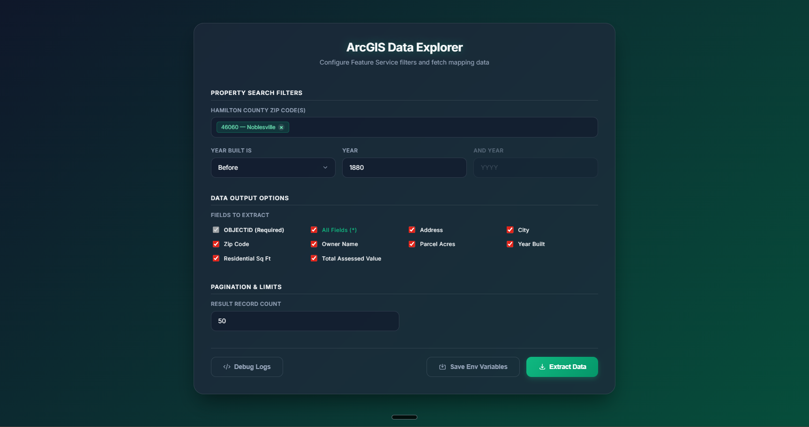

# ArcGIS Data Explorer

A powerful, user-friendly tool for exploring, filtering, and extracting property data from ArcGIS Feature Services. This project replaces complex SQL queries with intuitive search filters and provides direct navigation to property maps.



## 🚀 Key Features

- **Semantic Configuration**: Filter parcels by Zip Code and Year Built without writing a single line of SQL.
- **Web UI Control**: A modern, interactive dashboard to manage your search parameters and view results.
- **Smart Map Integration**: 
    - **ArcGIS Experience Map**: Direct links that use the address search widget to focus on specific properties.
    - **Google Maps**: One-click navigation to the property location.
- **Robust Save Logic**: Real-time feedback with a "Saved!" confirmation when updating environment variables via the UI.
- **JSON Data Extraction**: Saves raw results to a temporary directory for further analysis.

## 🛠 Project Architecture

The project follows a **3-Layer Architecture** to ensure reliability and maintainability:

1.  **Directive Layer**: Instructions and SOPs (found in `directives/`).
2.  **Orchestration Layer**: The `ui_server.py` which routes requests and manages the UI.
3.  **Execution Layer**: Deterministic scripts like `fetch_arcgis_data.py` that handle API interactions.

## 📋 Prerequisites

- **Python 3.8+**
- **pip** (Python package manager)

## 🔧 Setup

1.  **Install Dependencies**:
    ```bash
    pip install requests python-dotenv
    ```

2.  **Configure Environment**:
    The `.env/.env` file is the central source of truth. It is automatically managed by the UI, but can also be manually edited.
    ```env
    ARCGIS_FEATURE_SERVICE_URL=your_arcgis_url_here
    ZIP_CODE=46060
    YEAR_BUILT_CONDITION=any
    YEAR_BUILD_1=
    ```

## 🏃 Getting Started

1.  **Start the UI Server**:
    ```bash
    python execution/tools/ui_server.py
    ```

2.  **Open the Explorer**:
    Navigate to [http://localhost:8003](http://localhost:8003) in your web browser.

3.  **Filter & Extract**:
    - Select your **Zip Code** and **Year Built** criteria.
    - Choose the **Data Output Options** (fields to extract).
    - Click **Save Env Variables** to persist settings.
    - Click **Extract Data** to run the fetcher and view results in the table below.

## 📊 Onboarding Status

This project aims for 100% attribute coverage across all US counties. "Skeleton" counties are those with verified ArcGIS URLs but zero attribute mappings.

**Current Status**: 125+ Fully Mapped | 17 Skeletons Remaining

### Remaining Skeletons
To contribute, see [CONTRIBUTING.md](CONTRIBUTING.md).

- **CA**: Merced County
- **CO**: Gunnison County
- **GA**: Madison County
- **IA**: Franklin County
- **ID**: Clearwater County
- **IL**: LaSalle County
- **LA**: St. James Parish
- **MA**: Worcester County
- **ME**: Aroostook County
- **NC**: Yancey County
- **NY**: Delaware County
- **OH**: Defiance County, Highland County
- **OR**: Hood River County, Wallowa County
- **PA**: Potter County
- **TN**: Marion County, Scott County
- **WI**: Waupaca County
- **WV**: Wood County

## 📂 Directory Structure

- `.env/`: Configuration storage.
- `.tmp/`: Intermediate data results (e.g., `arcgis_raw_results.json`).
- `execution/`:
    - `fetch_arcgis_data.py`: Core data extraction logic.
    - `tools/`: UI Server and frontend templates.
- `directives/`: SOPs and workflow documentation.

---
